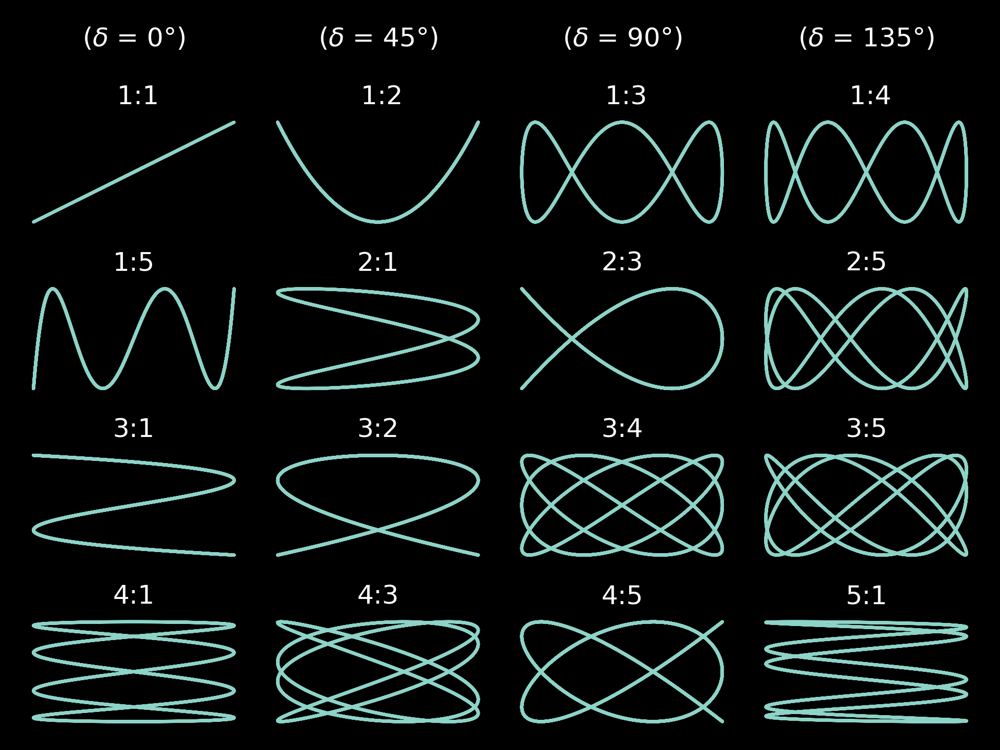

Ever since I started my undergraduate degree, I've always looked forward to the day where I'd start drawing patterns on an analog oscilliscope for funsies. Today seems like just the right day to start experimenting and there's no better place to start than the fundamentals. I introduce to you, the *Lissajou curve*.

  
  

## What are Lissajou Curves?
Lissajou curves, also known as Bowditch curves, are a special family of curves described by the linear set of parametric equations:

 

    \[
    \begin{cases}
    x(t) = A \sin(at + \delta) \\
    y(t) = B \sin(bt)
    \end{cases}
    \]

First investigated by Nathaniel Bowditch and later refined by its namesake Jules Antoine Lissajous (get mogged), these curves model the behavior that results from when two sinusoids lying on both the x and y directions of the cartesian plane are superposed.

Over time, this figure has been proven to be a useful tool with a variety of applications such as signal processing, orbital mechanics, music theory, and art. 

### Theory and Examples

By examining certain relationships between the variables in the equations, we can discover many things that influence the characteristics of a Lissajou curve. 

One place we can look, is at the ratio between the angular frequencies, \\( \frac{a}{b} \\). If this ratio is rational \\( (\frac{a}{b} \in \mathbb{Q}) \\), then the loop(s) of the curve will eventually close as the phase shift changes. On the other hand, if it is irrational \\( (\frac{a}{b} \in \mathbb{I})\\), the the loops of the curve will continue to be open.

We can also take note of the ratio between the wave amplitudes, \\( \frac{A}{B} \\). This ratio affects the proportions of the curve, causing it to either "squash" or "stretch," and can also lead to a rotation of the curve as the phase shift changes.

  
  
  <figure>
    <figcaption>Fig.1 - Lissajou curves with varying angular frequency ratios.
        
      (Image: <a href="#" target="_blank" rel="noopener noreferrer">Made with Matplotlib</a>)
       
    </figcaption>
  </figure>

The *eccentricity*, or how much a curve deviates from being a circle, is determined by the phase shift variable \\( \delta \\). This effect is best observed when the angular frequencies of the two waves are equal \\((a = b)\\). The graph below illustrates how the behavior of the curve changes over time as the phase shift varies under these conditions.

Personally, I had only discovered the name of this pattern through one of my previous internships over at MIT Lincoln Laboratory (MITLL) since they had it as their logo. They are rather enthusiastic about explaining its history and you can read more about it [here](https://www.ll.mit.edu/about/history/lincoln-laboratory-logo).

  
  
  <figure>
    <figcaption>Fig.2 - The Official Logo of MITLL.
        
      (Image: <a href="https://commons.wikimedia.org/wiki/File:Lincoln_Lab_icon.png" target="_blank" rel="noopener noreferrer">Wikipedia Commons</a>)
       
    </figcaption>
  </figure>

### Generating a Lissajou Curve 

To put away all the previous explanations, let's experiment by hooking up two sine waves to this old [brand name/model no.] oscilliscope I found on Facebook marketplace. Since I currently don't own a proper signal generator and I really want to play with breadboards more often, I will be designing  some sine wave generation circuits to do the job.

Animations and charts for this article were made using Matplotlib. You can find the Python scripts that I used to generate them all on my [GitHub page](https://github.com/p5electronics/website/blob/main/src/blog/2024/lissajou/animation.py).

Stay tuned for more!

### References

